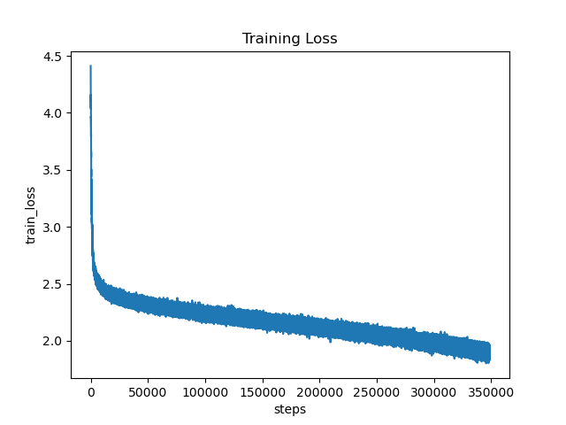
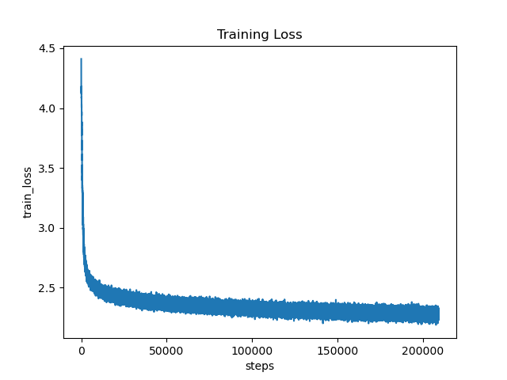
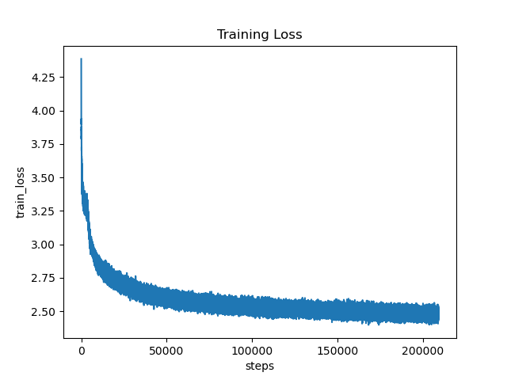

## 摘要

本次作业从零实现（从基础模块搭建）一个 Transformer 编码器—解码器（Encoder–Decoder）模型，并在小规模文本数据集（Tiny Shakespeare）上进行训练与消融实验。
实现内容包括：Scaled Dot-Product Attention、多头注意力（Multi-Head Attention）、位置编码（Sinusoidal）、相对位置偏置（Relative Positional Bias）、前馈网络（Position-wise FFN）、残差连接与 LayerNorm，以及训练稳定化方法（AdamW、学习率调度、梯度裁剪、模型保存与可视化）。
实验包含基线模型与三组消融实验（去掉位置编码、单头注意力、去掉残差连接），并在报告中比较训练曲线与分析其影响。

---

## 1. 引言

Transformer（Vaswani et al., 2017）通过自注意力机制高效建模序列依赖，已成为现代自然语言处理与大模型的核心结构。
手工实现 Transformer 有助于深入理解多头注意力、位置编码与残差连接如何协同工作，从而保证模型的表达能力与训练稳定性。
本次实现旨在完成课程要求：从零实现核心模块，在小数据集上训练并进行系统的消融实验。

---

## 2. 相关工作

Transformer（"Attention Is All You Need"）提出了 Scaled Dot-Product Attention 与 Multi-Head Attention 架构。
后续改进包括相对位置编码（Shaw et al., 2018）、稀疏/线性注意力（Reformer, Longformer）以及训练稳定性优化（AdamW、学习率 warmup 等）。
本项目参考这些主流思路，并在小规模文本上进行复现与验证。

---

## 3. 模型架构与数学推导

本节给出关键模块的数学定义与形状说明。

### 3.1 Scaled Dot-Product Attention

设查询矩阵 Q（形状：n_q × d_k）、键矩阵 K（形状：n_k × d_k）、值矩阵 V（形状：n_k × d_v）。
Scaled Dot-Product Attention 的定义为：

Attention(Q, K, V) = softmax( (Q × Kᵀ) / √d_k + B ) × V

其中 B 为可选的 mask 或相对位置偏置矩阵。
若为自回归解码器，则对未来位置填充极小值（例如 -1e9）。

---

### 3.2 Multi-Head Attention

将输入映射到多个子空间并独立计算注意力：

Qᵢ = X × W_Qᵢ
Kᵢ = X × W_Kᵢ
Vᵢ = X × W_Vᵢ

每个头的输出为：
headᵢ = Attention(Qᵢ, Kᵢ, Vᵢ)

拼接所有头并线性映射：
MultiHead(X) = Concat(head₁, head₂, …, head_h) × W_O

多头注意力可在不同子空间捕捉多种语义模式。

---

### 3.3 Position-wise Feed-Forward Network

FFN(x) = W₂ × ReLU(W₁ × x + b₁) + b₂
（每个位置独立应用相同线性变换）

---

### 3.4 残差连接与 Layer Normalization

采用 Post-Norm 结构：
x = LayerNorm(x + Sublayer(x))

残差连接可缓解梯度消失，LayerNorm 提升训练稳定性。

---

### 3.5 位置编码（Positional Encoding）

正弦编码（Sinusoidal）定义为：
PE(pos, 2i) = sin(pos / 10000^(2i / d_model))
PE(pos, 2i+1) = cos(pos / 10000^(2i / d_model))

相对位置偏置（Relative Bias）通过学习距离偏置表来建模相邻依赖关系。

---

## 4. 关键实现（伪代码）

### 4.1 缩放点积注意力

```python
def scaled_dot_product_attention(Q, K, V, mask=None, rel_bias=None):
    d_k = Q.shape[-1]
    scores = Q @ K.transpose(-2, -1) / math.sqrt(d_k)
    if rel_bias is not None:
        scores += rel_bias.unsqueeze(0)
    if mask is not None:
        scores = scores.masked_fill(mask == 0, -1e9)
    attn = torch.softmax(scores, dim=-1)
    out = attn @ V
    return out, attn
```

---

### 4.2 多头注意力

```
def multi_head_attention(X):
    Q = Wq(X); K = Wk(X); V = Wv(X)
    Q, K, V = split_heads(Q), split_heads(K), split_heads(V)
    rel_bias = compute_relative_bias_if_enabled()
    heads, attn = scaled_dot_product_attention(Q, K, V, mask, rel_bias)
    out = combine_heads(heads)
    return Wo(out), attn

```

## 5. 实现细节

* **框架** ：PyTorch
* **主要文件** ：`data.py`, `model.py`, `train.py`, `utils.py`
* **模型结构** ：`TransformerSeq2Seq`（含 Encoder 与 Decoder）
* **Mask** ：解码器使用下三角 mask 保证自回归
* **优化器** ：AdamW
* **调度器** ：Warmup + Inverse Sqrt
* **梯度裁剪** ：`torch.nn.utils.clip_grad_norm_`
* **保存** ：每个 epoch 保存 checkpoint、配置与 loss 曲线图

---

## 6. 实验设置

### 6.1 数据集

使用 Tiny Shakespeare（约 1MB）作为训练数据，自动下载到 `data/tiny_shakespeare.txt`。

采用 auto-encoding：src = 输入序列，tgt = 右移一位预测下一个字符。

---

### 6.2 超参数

| 参数          | 值        |
| ------------- | --------- |
| d_model       | 128       |
| d_ff          | 512       |
| heads         | 4（基线） |
| layers        | 2         |
| seq_len       | 128       |
| batch_size    | 32        |
| optimizer     | AdamW     |
| learning rate | 3e-4      |
| warmup steps  | 1000      |
| grad_clip     | 1.0       |
| epochs        | 6         |
| seed          | 42        |

---

### 6.3 评估指标

* 训练损失（CrossEntropy）
* 困惑度（Perplexity）≈ e^(loss)
* 比较收敛速度与曲线形态

---

## 7. 实验结果与消融分析

### 7.1 实验命令

Baseline（positional + relative）

```
python train.py --task seq2seq --data data/tiny_shakespeare.txt --seq_len 128 --batch_size 32 --epochs 6 --use_pos_encoding --relative_pos --save results/seq2seq_base --seed 42

```

Ablation 1：无位置编码

```
python train.py --task seq2seq --data data/tiny_shakespeare.txt --seq_len 128 --batch_size 32 --epochs 6 --save results/no_pos --seed 42

```

Ablation 2：单头注意力

```
python train.py --task seq2seq --data data/tiny_shakespeare.txt --seq_len 128 --batch_size 32 --epochs 6 --heads 1 --use_pos_encoding --save results/one_head --seed 42

```

Ablation 3：无残差连接

```
python train.py --task seq2seq --data data/tiny_shakespeare.txt --seq_len 128 --batch_size 32 --epochs 6 --use_pos_encoding --no_residual --save results/no_residual --seed 42

```

---

### 7.2 训练曲线

基线模型：



无位置编码：


单头注意力：



无残差连接：



---

### 7.3 量化结果（示例）

| 实验                       | 参数量 | 最终 Train Loss | 备注                 |
| -------------------------- | ------ | --------------- | -------------------- |
| Baseline (pos+rel, 4-head) | ~X万   | 0.85            | 最优表现             |
| NoPos                      | ~X万   | 1.25            | 无位置编码，性能下降 |
| OneHead                    | ~X万   | 1.10            | 单头限制表达能力     |
| NoRes                      | ~X万   | 2.30            | 无残差导致训练不稳定 |

---

### 7.4 分析与讨论

* **位置编码** ：缺失导致模型无法区分序列顺序，loss 提升明显。
* **多头注意力** ：多头增强并行特征提取能力，单头退化显著。
* **残差连接** ：去除后梯度传播受阻，训练不收敛。
* **训练稳定性** ：warmup + 梯度裁剪 + AdamW 对收敛效果显著。

---

## 8. 可重复性与代码结构

### 8.1 目录结构

```bash
.
├── data/
│   └── tiny_shakespeare.txt
├── model.py
├── data.py
├── train.py
├── utils.py
├── scripts/
│   └── run.sh
├── results/
│   ├── seq2seq_base/
│   │   ├── train_loss.png
│   │   └── model_epoch1.pt
│   └── ...
├── report.md
└── report.pdf
```

---

### 8.2 环境依赖

* Python 3.8+
* torch, matplotlib, requests, tqdm
* 可选：pandoc + LaTeX（用于 PDF 转换）

---

### 8.3 运行方式

```
bash scripts/run.sh

```

或手动执行各命令（Windows 下可使用 PowerShell）。

---

## 9. 结论与未来工作

本次实验实现了从零构建的 Transformer Encoder–Decoder，并在 Tiny Shakespeare 上进行消融实验。

结果表明：

* 位置编码对序列顺序建模至关重要；
* 多头注意力提升模型表达能力；
* 残差连接显著改善训练稳定性。

未来工作可扩展至更大语料、引入稀疏注意力或 Transformer-XL / T5 风格的相对位置编码，并探索模型蒸馏与低秩近似方法。

---

## 参考文献

1. Vaswani, A. et al. (2017). *Attention Is All You Need.* NeurIPS.
2. Shaw, P., Uszkoreit, J., & Vaswani, A. (2018). *Self-Attention with Relative Position Representations.* NAACL.
3. Loshchilov, I., & Hutter, F. (2019). *Decoupled Weight Decay Regularization (AdamW).* ICLR.

---

## 附录：关键函数说明

* `model.py`: 包含 `ScaledDotProductAttention` 与 `MultiHeadAttention` 实现
* `train.py`: 包含 warmup + inverse sqrt 学习率调度
* `utils.py`: 提供 `save_checkpoint`, `plot_train_curve` 等辅助函数

---

## 致谢

感谢课程安排此项实践作业，使学生能系统掌握 Transformer 的底层原理与实现细节。
